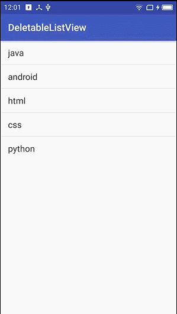
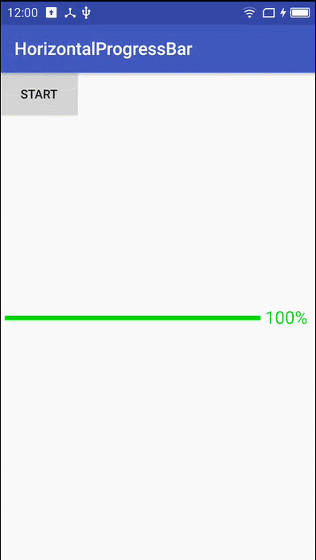
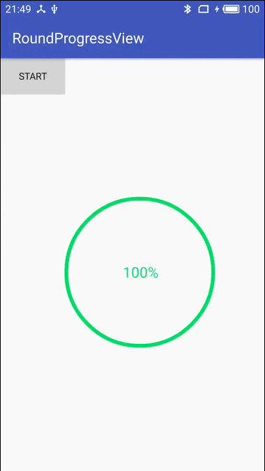
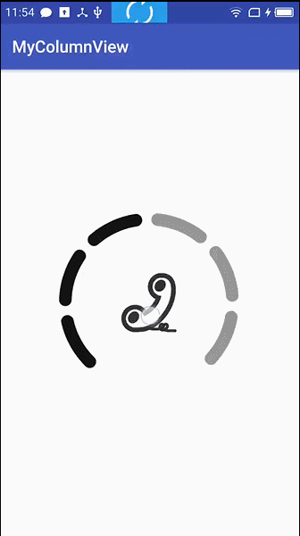
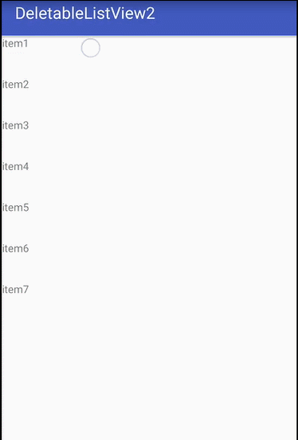

#MyCustomViewPractice
- ##deletablelistview  
向左滑动list的item，右边出现删除按钮，点击删除按钮可删除这个item(用popupWindow实现)  
  
- ##horizontalprogressbar  
横向的进度条，右边用数值显示当前进度  
  
- ##roundprogressview  
圆形的进度条，中间用数值显示当前进度  
  
- ##columnview  
音量控制view，上滑增加音量，下滑降低音量  
  
- ##deletelistview2.gif  
向左滑动list的item，右边出现删除按钮，点击删除按钮可删除这个item(用动态添加button的方法实现)  
